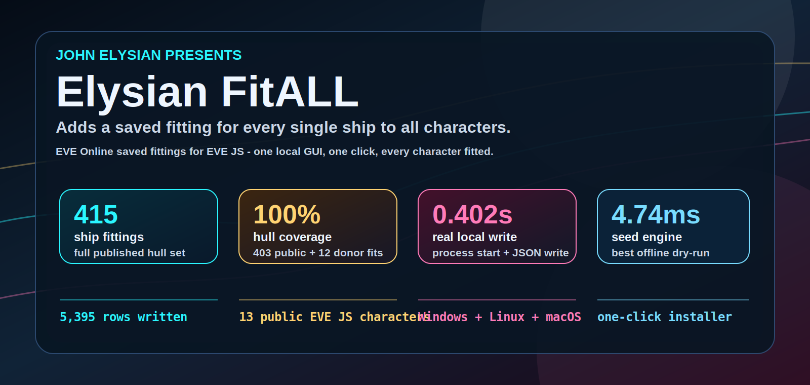
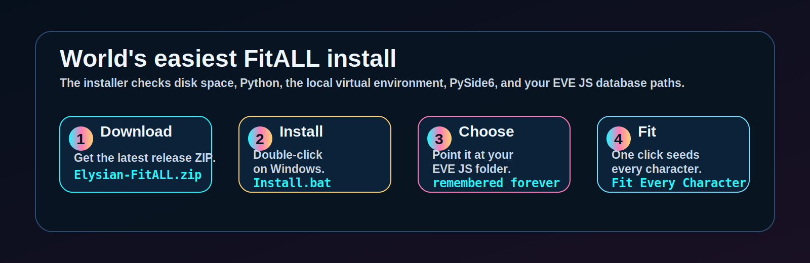
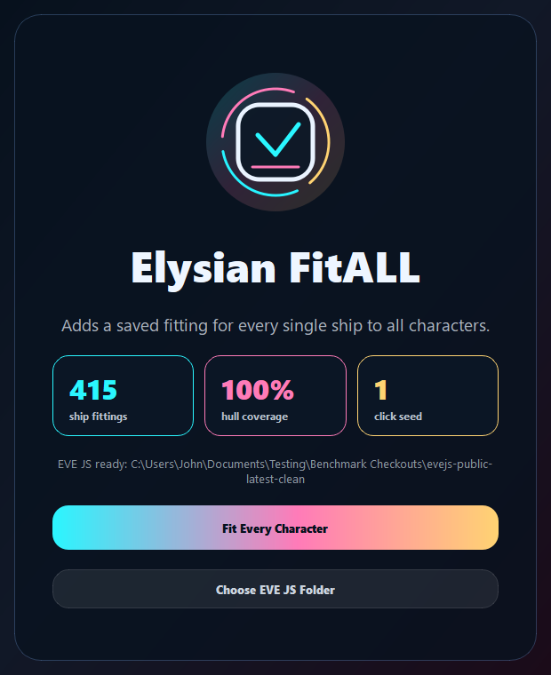
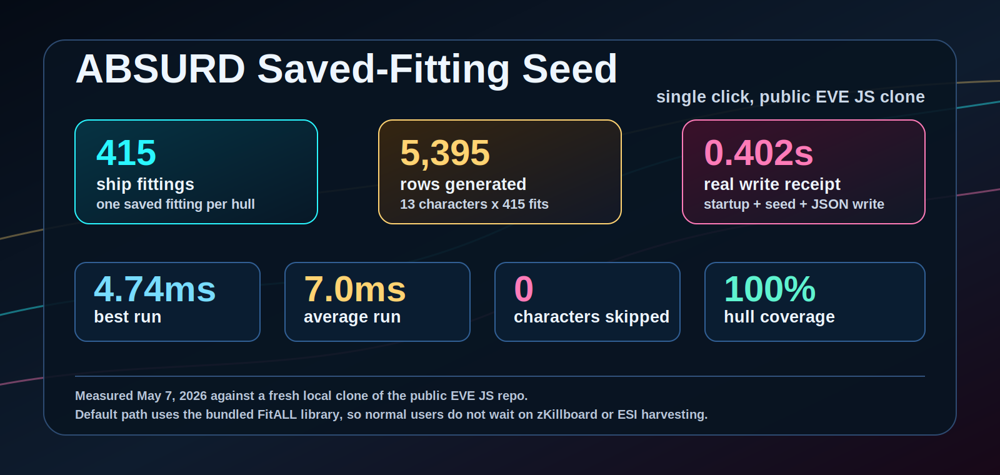

<p align="center">
  
</p>

<h1 align="center">Elysian FitALL - EVE Online Saved Fittings for EVE JS</h1>

<p align="center">
  <strong>Adds a saved fitting for every single ship to all characters.</strong>
</p>

<p align="center">
  <a href="https://github.com/JohnElysian/elysian-fitall-eve-online-evejs-saved-fittings/actions/workflows/ci.yml"></a>
  <a href="https://github.com/JohnElysian/elysian-fitall-eve-online-evejs-saved-fittings/releases/latest"></a>
  
  
</p>

<p align="center">
  <a href="#download--install"><strong>Download</strong></a>
  |
  <a href="#the-app"><strong>Screenshot</strong></a>
  |
  <a href="#benchmark-receipt"><strong>Benchmarks</strong></a>
  |
  <a href="#built-for-eve-js"><strong>EVE JS</strong></a>
</p>

Elysian FitALL is a tiny desktop tool for [EVE JS](https://github.com/evejs-emu/eve.js) servers. Point it at your EVE JS checkout, press one button, and every character gets one saved fitting for every published ship hull.

The normal path is offline and instant: the release includes the curated FitALL library, so users do not wait on zKillboard or ESI harvesting just to seed their server.

## Download & Install

<p align="center">
  
</p>

Windows users should download the latest release:

```text
https://github.com/JohnElysian/elysian-fitall-eve-online-evejs-saved-fittings/releases/latest
```

Extract `Elysian-FitALL.zip`, then double-click `Install.bat`.

The installer checks free disk space, Python, the local virtual environment, PySide6, and your EVE JS database paths. If Python is missing, it tries to install Python automatically, then launches the app.

After setup, use `StartFitALL.bat`.

## Linux & macOS

Extract the latest release, open a terminal in the FitALL folder, then run one command:

```bash
chmod +x Install.sh StartFitALL.sh && ./Install.sh
```

The installer uses `brew` or the official Python package on macOS, and common Linux package managers such as `apt`, `dnf`, `yum`, `pacman`, `zypper`, or `apk` on Linux. After setup, use:

```bash
./StartFitALL.sh
```

## The App

<p align="center">
  
</p>

FitALL opens as a small staged desktop app: a John Elysian intro, one clean setup screen, one progress screen, and one done screen. The main action is intentionally simple: `Fit Every Character`.

## Benchmark Receipt

<p align="center">
  
</p>

Measured on May 7, 2026 against a fresh local clone of the public EVE JS repo:

| Result | Meaning |
| --- | --- |
| `415 / 415` ship fittings | One saved fitting for every published ship hull in the bundled library |
| `5,395` rows generated | 13 public EVE JS characters x 415 fittings |
| `0.402s` real write receipt | Python startup + library load + seed + savedFittings JSON write |
| `4.74ms` best engine dry-run | Hot local seed path without process startup or disk write |
| `0` skipped characters | Public clone test had enough fitting slots for every character |

## Built For EVE JS

FitALL writes EVE JS saved fittings here:

```text
server/src/newDatabase/data/savedFittings/data.json
```

It reads characters from:

```text
server/src/newDatabase/data/characters/data.json
```

Existing non-FitALL fittings are preserved. Existing FitALL-managed fittings are replaced cleanly, and a backup is written before a real seed.

## Advanced CLI

The desktop app is the intended path. The CLI is available for automation:

```bash
python fitall.py seed-saved-fittings
python fitall.py benchmark-seed
python fitall.py build-library
```

Use `EVEJS_REPO_ROOT` if you want to point the CLI at a specific EVE JS checkout:

```bash
EVEJS_REPO_ROOT=/path/to/eve.js python fitall.py seed-saved-fittings
```

## License

Elysian FitALL is open source under `AGPL-3.0-or-later`.
